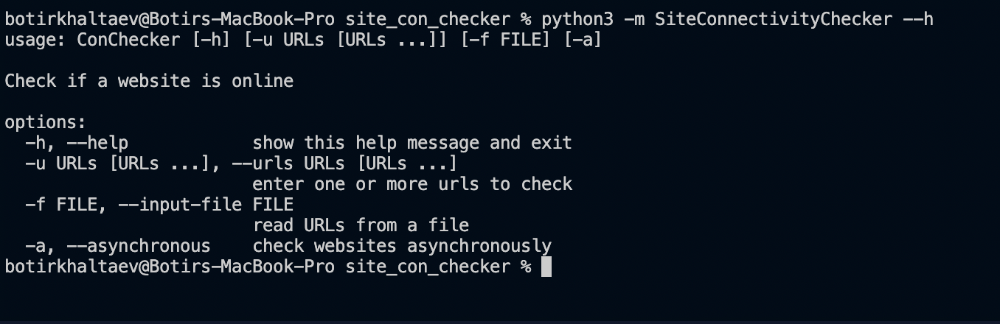

# Site Connectivity Checker 

## Table of Contents
* [General info](#general-info)
* [Technologies](#technologies)
* [Setup](#setup)

## General Info
This is a simple CLI application that takes a url as input and sends a HTTP request to a website's server in order to see it's status

## Technologies

aiohttp==3.7.4.post0

## Setup
To run this project , install it locally using python
```
cd ../site_con_checker
pip install aiohttp==3.7.4.post0

For macOs:
python3 -m SiteConnectivityChecker --h to see a list of commands

For Windows/Linux:
python -m SiteConnectivityChecker --h to see a list of commands
```
## Application Illustration




